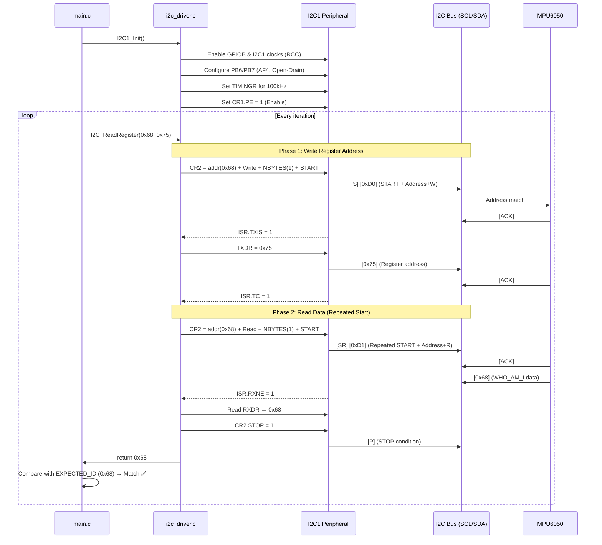

# Register-Level I2C Driver — Deep-Dive Walkthrough

> **Project**: Bare-metal I2C master driver for STM32F767ZI (ARM Cortex-M7)
> **Language**: C (no HAL, no RTOS)
> **Peripheral**: I2C V2 (STM32F7 family)
> **Test Device**: MPU6050 6-axis IMU (slave address `0x68`)

---

## 1. What Is I2C? — Protocol Fundamentals

### 1.1 The Two-Wire Bus

I2C (**Inter-Integrated Circuit**, pronounced "I-squared-C") is a **synchronous, half-duplex, multi-master, multi-slave** serial bus invented by Philips (now NXP) in 1982. It uses only two signal lines:

| Line | Name | Role |
|------|------|------|
| **SCL** | Serial Clock | Master-generated clock signal |
| **SDA** | Serial Data | Bidirectional data line |

Both lines are **open-drain** and require **external pull-up resistors** (typically 4.7 kΩ to V_DD). This is a critical electrical constraint — the bus is **active-low**:
- A device can pull a line **LOW** (assert).
- A device **releases** the line to go HIGH (via the pull-up resistor).
- No device ever *drives* the line HIGH actively, which prevents electrical contention when multiple devices are on the bus.

### 1.2 Speed Modes

| Mode | Max Frequency | Your Driver |
|------|---------------|-------------|
| Standard Mode | 100 kHz | ✅ Used |
| Fast Mode | 400 kHz | Not configured |
| Fast Mode Plus | 1 MHz | Not configured |
| High Speed | 3.4 MHz | Not supported on I2C V2 |

Your TIMINGR register is configured for **100 kHz Standard Mode**.

### 1.3 The I2C Transaction Frame

A typical I2C write transaction looks like this:

```
[START] [7-bit Address + R/W bit] [ACK] [Data Byte] [ACK] ... [STOP]
  ↑            ↑                    ↑        ↑         ↑         ↑
  SDA goes    Master sends        Slave     Master    Slave    SDA goes
  LOW while   address + 0=W/1=R  pulls     sends     pulls    HIGH after
  SCL HIGH                        SDA LOW   payload   SDA LOW  SCL HIGH
```

**Key rules:**
- **START condition**: SDA transitions HIGH → LOW while SCL is HIGH
- **STOP condition**: SDA transitions LOW → HIGH while SCL is HIGH
- **Data validity**: SDA must be stable during SCL HIGH; changes only when SCL is LOW
- **ACK/NACK**: After every 8 data bits, the *receiver* drives SDA LOW (ACK) or leaves it HIGH (NACK) during the 9th clock pulse

### 1.4 Repeated Start (SR)

Instead of sending STOP followed by a new START, the master can issue a **Repeated Start** — a START condition without a preceding STOP. This is essential for register reads:

```
[S] [Addr+W] [ACK] [RegAddr] [ACK] [SR] [Addr+R] [ACK] [Data] [NACK] [P]
        Write phase                        Read phase
```

Your [I2C_ReadRegister](file:///c:/Users/kaush/OneDrive/Desktop/Quantum-Networks-Task/I2C_DRV_STM32-main/i2c_driver.c#L105-L130) function implements exactly this pattern.

---

## 2. Hardware & Electrical Constraints

### 2.1 Why Open-Drain?

```
       V_DD (3.3V)
         │
        ┌┤ 4.7kΩ (external pull-up)
        │
SDA ────┼──── Device A (open-drain FET)
        │
        └──── Device B (open-drain FET)
```

**Constraint**: I2C is a **wired-AND** bus. If *any* device pulls low, the line is low. This enables:
- **Clock stretching**: A slow slave can hold SCL LOW to pause the master
- **Multi-master arbitration**: If two masters transmit simultaneously, the one sending a '1' (releasing SDA) while the other sends '0' (pulling SDA) will detect the discrepancy and back off
- **No bus contention / short circuits**: Since no device ever actively drives HIGH

### 2.2 Pull-Up Resistor Value

The pull-up value is a trade-off:
- **Too high** (10 kΩ+): Slow rise time → limits maximum bus speed
- **Too low** (1 kΩ): Too much current sink from open-drain FETs → exceeds I_OL spec (typically 3 mA)
- **Sweet spot**: 4.7 kΩ for 100 kHz, 2.2 kΩ for 400 kHz
- Your code also enables **internal pull-ups** on PB6/PB7 (PUPDR register), which is fine for prototyping but external pull-ups are recommended for production.

### 2.3 Bus Capacitance

I2C spec limits total bus capacitance to **400 pF** (Standard Mode). Each device adds ~10 pF, and each cm of PCB trace adds ~1-2 pF. This limits:
- Number of devices on the bus
- Maximum trace length

### 2.4 Voltage Levels (STM32F767ZI)

| Parameter | Value |
|-----------|-------|
| V_DD | 3.3V |
| V_IL (input low) | ≤ 0.3 × V_DD = 0.99V |
| V_IH (input high) | ≥ 0.7 × V_DD = 2.31V |
| I_OL (sink current) | 3 mA max |

---

## 3. STM32F7 Memory-Mapped Peripherals — How Register Access Works

### 3.1 No Magic — It's Just Pointers

On ARM Cortex-M, peripherals are **memory-mapped**. The CMSIS header (`stm32f7xx.h`) defines structures like:

```c
#define I2C1    ((I2C_TypeDef *) 0x40005400UL)
```

So when you write `I2C1->CR1 |= I2C_CR1_PE;`, you're actually doing:

```c
*((volatile uint32_t *)(0x40005400 + 0x00)) |= (1U << 0);
```

The `volatile` keyword is critical — it tells the compiler "this memory location can change outside my control (by hardware), so never optimize away reads/writes to it."

### 3.2 Read-Modify-Write Pattern

Throughout your driver, you use the `|=` and `&= ~` pattern:

```c
GPIOB->MODER &= ~((3U << (6 * 2)) | (3U << (7 * 2)));  // Clear bits first
GPIOB->MODER |=  ((2U << (6 * 2)) | (2U << (7 * 2)));  // Set desired bits
```

**Why two steps?** If the register has other bits you don't want to disturb, you must:
1. **Clear** only the target bits (AND with inverted mask)
2. **Set** the desired value (OR with value)

If you just did `|=` without clearing first, you might get incorrect bit patterns (e.g., setting `0b10` when `0b01` is already there gives `0b11`, not `0b10`).

---

## 4. Code Walkthrough — Register by Register

### 4.1 Clock Initialization ([I2C1_Init](file:///c:/Users/kaush/OneDrive/Desktop/Quantum-Networks-Task/I2C_DRV_STM32-main/i2c_driver.c#L13-L69), Lines 14-16)

```c
RCC->AHB1ENR |= RCC_AHB1ENR_GPIOBEN;   // Enable GPIOB clock
RCC->APB1ENR |= RCC_APB1ENR_I2C1EN;     // Enable I2C1 clock
```

> [!IMPORTANT]
> **Why is this the very first step?**
> On STM32, peripheral clocks are **gated by default** to save power. Any register access to a peripheral whose clock is disabled results in a **bus fault** (HardFault). The RCC (Reset and Clock Control) unit acts as the power switch for each peripheral.

| Register | Bit | Peripheral | Bus |
|----------|-----|------------|-----|
| `RCC->AHB1ENR` | Bit 1 (`GPIOBEN`) | GPIO Port B | AHB1 (high-speed bus) |
| `RCC->APB1ENR` | Bit 21 (`I2C1EN`) | I2C1 | APB1 (low-speed peripheral bus, max 42 MHz) |

**Key architectural insight**: GPIOs are on the **AHB1** bus (fast, single-cycle access), while I2C is on the **APB1** bus (slower, max 42 MHz). The I2C clock source is APB1's PCLK1.

---

### 4.2 GPIO Configuration (Lines 18-39)

You configure **PB6 (SCL)** and **PB7 (SDA)** through five GPIO registers:

#### MODER — Mode Register (Lines 20-21)

```c
GPIOB->MODER &= ~((3U << (6 * 2)) | (3U << (7 * 2)));  // Clear bits 12-15
GPIOB->MODER |=  ((2U << (6 * 2)) | (2U << (7 * 2)));  // Set to AF mode
```

Each pin has 2 bits in MODER:
| Value | Mode |
|-------|------|
| `00` | Input (reset state) |
| `01` | General purpose output |
| `10` | **Alternate Function** ← You use this |
| `11` | Analog |

**Why Alternate Function?** You're handing control of these pins to the I2C1 peripheral hardware, not driving them manually with GPIO writes.

#### OTYPER — Output Type Register (Line 25)

```c
GPIOB->OTYPER |= (1U << 6) | (1U << 7);  // Open-Drain
```

| Value | Type |
|-------|------|
| `0` | Push-Pull |
| `1` | **Open-Drain** ← Required for I2C |

> [!CAUTION]
> **This is non-negotiable.** If you configure push-pull instead of open-drain, you will get **bus contention** — the master could actively drive HIGH while a slave is trying to pull LOW, potentially damaging both devices.

#### OSPEEDR — Output Speed Register (Line 29)

```c
GPIOB->OSPEEDR |= (3U << (6 * 2)) | (3U << (7 * 2));  // Very High Speed
```

| Value | Speed | Slew Rate |
|-------|-------|-----------|
| `00` | Low (4 MHz) | Slow edges |
| `01` | Medium (25 MHz) | |
| `10` | High (50 MHz) | |
| `11` | **Very High (100 MHz)** ← You use this | Fastest edges |

**Trade-off**: Higher speed → faster edges → more EMI noise but better signal integrity at high bus speeds. For 100 kHz I2C, `Medium` would suffice, but `Very High` doesn't hurt.

#### PUPDR — Pull-Up/Pull-Down Register (Lines 33-34)

```c
GPIOB->PUPDR &= ~((3U << (6 * 2)) | (3U << (7 * 2)));
GPIOB->PUPDR |=  ((1U << (6 * 2)) | (1U << (7 * 2)));  // Pull-up
```

| Value | Mode |
|-------|------|
| `00` | No pull-up, no pull-down |
| `01` | **Pull-up** ← You use this |
| `10` | Pull-down |
| `11` | Reserved |

**Note**: Internal pull-ups (~40 kΩ) are weaker than recommended external pull-ups (4.7 kΩ). For short bus lengths and single-slave setups (like MPU6050 on a breakout board), they work. For production or long buses, use external pull-ups.

#### AFR[0] — Alternate Function Low Register (Lines 38-39)

```c
GPIOB->AFR[0] &= ~((0xFU << (6 * 4)) | (0xFU << (7 * 4)));
GPIOB->AFR[0] |=  ((0x4U << (6 * 4)) | (0x4U << (7 * 4)));  // AF4
```

Each pin has 4 bits to select one of 16 alternate functions (AF0–AF15). For STM32F767ZI:

| AF Number | Function on PB6 | Function on PB7 |
|-----------|-----------------|-----------------|
| AF4 | **I2C1_SCL** ← You use this | **I2C1_SDA** ← You use this |

**How to find this**: Look up the STM32F767ZI datasheet, Table "Alternate function mapping". This is MCU-specific and must be looked up — there's no formula.

---

### 4.3 I2C Timing Configuration — The Math ([I2C1_Init](file:///c:/Users/kaush/OneDrive/Desktop/Quantum-Networks-Task/I2C_DRV_STM32-main/i2c_driver.c#L41-L68), Lines 41-68)

> [!IMPORTANT]
> This is the **most interview-critical** section. Understanding TIMINGR proves you didn't just copy-paste register values.

#### V1 vs V2 I2C Peripheral

| Feature | I2C V1 (STM32F1/F4) | I2C V2 (STM32F0/F3/F7/L4) |
|---------|-------------------|-----------------------|
| Timing Registers | `CCR` + `TRISE` | **`TIMINGR`** (single register) |
| Start/Address | Manual bit-banging of `SR1`/`SR2` | Automated via `CR2` |
| Transfer Control | Manual byte-level | `NBYTES` + `AUTOEND`/`RELOAD` |

Your driver targets the **V2 peripheral** (STM32F767ZI).

#### TIMINGR Register Layout (32 bits)

```
Bits [31:28]  PRESC   — Prescaler (divides I2C clock source)
Bits [23:20]  SCLDEL  — Data setup time (SCL delay after SDA change)
Bits [19:16]  SDADEL  — Data hold time (SDA hold after SCL falling edge)
Bits [15:8]   SCLH    — SCL high period (in prescaled clock cycles)
Bits [7:0]    SCLL    — SCL low period (in prescaled clock cycles)
```

#### Your Configured Values

```c
I2C1->TIMINGR = (7U << 28) |     // PRESC  = 7
                (4U << 20) |     // SCLDEL = 4
                (2U << 16) |     // SDADEL = 2
                (0x0FU << 8) |   // SCLH   = 15
                (0x13U << 0);    // SCLL   = 19
```

#### The Math — Deriving 100 kHz from 42 MHz

**Step 1: Prescaler**

```
t_PRESC = (PRESC + 1) × t_I2CCLK
t_I2CCLK = 1 / 42 MHz = 23.81 ns
t_PRESC = (7 + 1) × 23.81 ns = 190.48 ns
```

**Step 2: SCL Period**

```
t_SCL_LOW  = (SCLL + 1) × t_PRESC = (19 + 1) × 190.48 ns = 3,809.6 ns
t_SCL_HIGH = (SCLH + 1) × t_PRESC = (15 + 1) × 190.48 ns = 3,047.7 ns

t_SCL = t_SCL_LOW + t_SCL_HIGH = 6,857.3 ns

f_SCL = 1 / t_SCL ≈ 145.8 kHz
```

> [!NOTE]
> The math gives ~146 kHz, which is slightly above 100 kHz. In practice, the sync logic, analog filter delay (~50-260 ns), and digital filter add additional cycles that bring the actual frequency closer to 100 kHz. The I2C spec guarantees that the slave will work at any speed **up to** its maximum, so 146 kHz is within Standard Mode limits. STM recommends using their **CubeMX I2C timing calculator** or the **AN4235** application note for production-quality values.

**Step 3: Setup and Hold Times**

```
t_SCLDEL = (SCLDEL + 1) × t_PRESC = 5 × 190.48 ns = 952.4 ns
    (I2C spec requires ≥ 250 ns for Standard Mode — ✅ satisfied)

t_SDADEL = SDADEL × t_PRESC = 2 × 190.48 ns = 380.96 ns
    (I2C spec requires ≥ 0 ns — ✅ satisfied)
```

#### The Older F4-Style Math (For Reference / Interview)

Your code comments mention the older CCR/TRISE approach:

```
f_SCL = PCLK1 / (2 × CCR)
100,000 = 42,000,000 / (2 × CCR)
CCR = 210

TRISE = (Max_Rise_Time / t_PCLK1) + 1
TRISE = (1000 ns / 23.81 ns) + 1 = 43
```

**Why mention this?** Many interview questions reference the simpler CCR math because it's more intuitive. Being able to compare V1 and V2 approaches shows depth.

---

### 4.4 Communication State Machine

#### [I2C_Start](file:///c:/Users/kaush/OneDrive/Desktop/Quantum-Networks-Task/I2C_DRV_STM32-main/i2c_driver.c#L76-L88) — Generating a START + Address (Lines 76-88)

```c
void I2C_Start(uint8_t saddr, uint8_t direction) {
    I2C1->CR2 &= ~(I2C_CR2_SADD | I2C_CR2_NBYTES | I2C_CR2_RD_WRN);
    
    I2C1->CR2 |= (saddr << 1);        // 7-bit address in bits [7:1]
    if (direction) 
        I2C1->CR2 |= I2C_CR2_RD_WRN;  // Bit 10: 1=Read, 0=Write
    I2C1->CR2 |= (1U << 16);          // NBYTES = 1
    
    I2C1->CR2 |= I2C_CR2_START;       // Generate START
}
```

**CR2 Register breakdown:**

| Field | Bits | Your Value | Purpose |
|-------|------|------------|---------|
| `SADD` | [9:0] | `saddr << 1` | 7-bit slave address in bits [7:1], bit 0 is R/W in 10-bit mode |
| `RD_WRN` | [10] | 0 or 1 | Transfer direction: 0=Write, 1=Read |
| `NBYTES` | [23:16] | 1 | Number of bytes to transfer |
| `START` | [13] | 1 | Generate START condition |

> [!NOTE]
> **V2 advantage**: On the older V1 peripheral, you had to manually send the address byte after START, then poll `SR1.ADDR` and read `SR2` to clear it (a notoriously tricky "ADDR flag clearing" dance). The V2 peripheral automates all of this — you just load CR2 and set START.

#### [I2C_Write](file:///c:/Users/kaush/OneDrive/Desktop/Quantum-Networks-Task/I2C_DRV_STM32-main/i2c_driver.c#L90-L93) — Transmitting a Byte (Lines 90-93)

```c
void I2C_Write(uint8_t data) {
    while (!(I2C1->ISR & I2C_ISR_TXIS));  // Poll until TXDR is empty
    I2C1->TXDR = data;                     // Write byte to transmit register
}
```

- **`TXIS` (TX Interrupt Status)**: Set by hardware when the transmit data register is empty and ready for the next byte
- **Polling loop**: Blocks until hardware is ready — simple but burns CPU cycles

#### [I2C_Read](file:///c:/Users/kaush/OneDrive/Desktop/Quantum-Networks-Task/I2C_DRV_STM32-main/i2c_driver.c#L95-L98) — Receiving a Byte (Lines 95-98)

```c
uint8_t I2C_Read(uint8_t ack) {
    while (!(I2C1->ISR & I2C_ISR_RXNE));  // Poll until data received
    return (uint8_t)I2C1->RXDR;
}
```

- **`RXNE` (RX Not Empty)**: Set when a complete byte has been received into RXDR
- **`ack` parameter**: Present in the signature but **not used in the body** — on the V2 peripheral, ACK/NACK is controlled by NBYTES and AUTOEND/RELOAD, not manually per byte

#### [I2C_Stop](file:///c:/Users/kaush/OneDrive/Desktop/Quantum-Networks-Task/I2C_DRV_STM32-main/i2c_driver.c#L100-L103) — Generating STOP (Lines 100-103)

```c
void I2C_Stop(void) {
    I2C1->CR2 |= I2C_CR2_STOP;
    while (I2C1->CR2 & I2C_CR2_STOP);  // Wait for hardware to clear STOP bit
}
```

The hardware automatically generates the STOP condition on the bus (SDA LOW→HIGH while SCL is HIGH) and then clears the STOP bit in CR2.

---

### 4.5 The High-Level API: [I2C_ReadRegister](file:///c:/Users/kaush/OneDrive/Desktop/Quantum-Networks-Task/I2C_DRV_STM32-main/i2c_driver.c#L105-L130) (Lines 105-130)

This is the most sophisticated function — it performs a **register read** using the Repeated Start pattern:

```
Phase 1 (Write):  [S] [0x68+W] [ACK] [0x75] [ACK]     ← Tell slave which register
Phase 2 (Read):   [SR] [0x68+R] [ACK] [data] [NACK] [P] ← Read the register value
```

```c
uint8_t I2C_ReadRegister(uint8_t devAddr, uint8_t regAddr) {
    // --- Phase 1: Write the register address ---
    I2C1->CR2 &= ~I2C_CR2_NBYTES;
    I2C1->CR2 |= (1U << 16) | (devAddr << 1);      // 1 byte, slave addr, write
    I2C1->CR2 &= ~I2C_CR2_RD_WRN;                    // Direction = Write
    I2C1->CR2 |= I2C_CR2_START;                       // Generate START

    while (!(I2C1->ISR & I2C_ISR_TXIS));              // Wait for TX ready
    I2C1->TXDR = regAddr;                              // Send register address

    while (!(I2C1->ISR & I2C_ISR_TC));                 // Wait for Transfer Complete
    
    // --- Phase 2: Read the data with Repeated Start ---
    I2C1->CR2 &= ~I2C_CR2_NBYTES;
    I2C1->CR2 |= (1U << 16) | (devAddr << 1) | I2C_CR2_RD_WRN;  // 1 byte, read
    I2C1->CR2 |= I2C_CR2_START;                       // Generate REPEATED START

    while (!(I2C1->ISR & I2C_ISR_RXNE));              // Wait for data
    data = (uint8_t)I2C1->RXDR;                       // Read received byte

    I2C_Stop();                                        // Generate STOP
    return data;
}
```

> [!IMPORTANT]
> **Why TC (Transfer Complete) instead of TXE?**
> `TC` is set by the V2 peripheral when `NBYTES` bytes have been transferred **and** AUTOEND is not set. It means the peripheral is waiting for software to either:
> 1. Issue a STOP (end transfer), or
> 2. Issue a new START (repeated start for direction change)
>
> This is what enables the seamless write-then-read pattern without releasing the bus.

---

### 4.6 Application Code: [main.c](file:///c:/Users/kaush/OneDrive/Desktop/Quantum-Networks-Task/I2C_DRV_STM32-main/main.c)

```c
#define MPU6050_ADDR     0x68
#define WHO_AM_I_REG     0x75
#define EXPECTED_ID      0x68
```

The MPU6050's `WHO_AM_I` register (address `0x75`) returns `0x68` — the device's factory-programmed ID. This is the standard way to verify:
1. The I2C bus is electrically functional
2. The driver's timing is correct
3. The slave device is present and responding

---

## 5. Design Decisions & Trade-offs

### 5.1 Why No HAL?

| Aspect | HAL | Your Bare-Metal Approach |
|--------|-----|--------------------------|
| Code size | ~10-50 KB for I2C HAL | ~200 bytes |
| Latency | Multiple abstraction layers | Direct register access (1-2 cycles) |
| Portability | Across STM32 families | Specific to STM32F7 (V2 peripheral) |
| Learning | Black box | Forces understanding of hardware |
| Debugging | Must trace through HAL source | WYSIWYG — what you write is what executes |
| Certification | Harder to certify opaque code | Deterministic, auditable |

**Interview answer**: "I chose bare-metal to minimize latency and code footprint, and because in safety-critical or real-time embedded systems, you need to understand exactly what the hardware is doing. HAL abstractions can hide timing issues and make debugging bus faults much harder."

### 5.2 Polling vs. Interrupt vs. DMA

Your driver uses **polling** (busy-wait loops):

```c
while (!(I2C1->ISR & I2C_ISR_TXIS));  // CPU spins here
```

| Method | CPU Usage | Complexity | When to Use |
|--------|-----------|------------|-------------|
| **Polling** (yours) | 100% during transfer | Low | Single-threaded, simple systems |
| **Interrupt** | ~0% during transfer | Medium | Multi-tasking, RTOS environments |
| **DMA** | ~0% + no ISR overhead | High | Bulk transfers, audio/sensor streaming |

**Interview answer**: "I used polling for simplicity and because this was a single-threaded bare-metal application with no other tasks to schedule. In a production system with an RTOS, I'd use interrupt-driven I2C with a semaphore for task notification, or DMA for bulk multi-byte reads."

### 5.3 No Timeout — A Known Limitation

> [!WARNING]
> Your `while()` loops have **no timeout mechanism**. If the slave device is absent, disconnected, or pulls SCL low indefinitely (clock stretching gone wrong), your code will **hang forever**.

A production driver would add:

```c
uint32_t timeout = 100000;
while (!(I2C1->ISR & I2C_ISR_TXIS)) {
    if (--timeout == 0) return I2C_ERROR_TIMEOUT;
}
```

### 5.4 No Error Handling

The I2C V2 peripheral has an `ISR` register with several error flags:

| Flag | Meaning |
|------|---------|
| `NACKF` | Slave sent NACK (wrong address, busy, register doesn't exist) |
| `BERR` | Bus error (misplaced START/STOP detected) |
| `ARLO` | Arbitration lost (another master won) |
| `OVR` | Overrun/underrun |

Your driver doesn't check any of these. A robust driver would clear and handle them.

---

## 6. The MPU6050 — Why This Slave Device?

The **MPU6050** is a popular choice for I2C driver validation:

| Property | Value |
|----------|-------|
| Slave Address | `0x68` (AD0=LOW) or `0x69` (AD0=HIGH) |
| WHO_AM_I register | `0x75`, returns `0x68` |
| Bus speed | Up to 400 kHz |
| Voltage | 3.3V (compatible with STM32) |
| Sensors | 3-axis accelerometer + 3-axis gyroscope |

It's ideal because:
1. Cheap and widely available on breakout boards
2. `WHO_AM_I` provides instant verification
3. Well-documented register map
4. Supports both Standard and Fast mode

---

## 7. Common Interview Questions & Answers

### Q1: "What happens on the bus when you call `I2C_ReadRegister(0x68, 0x75)`?"

**A**: The function performs a **combined write-then-read** transaction:

1. **START**: SDA goes LOW while SCL is HIGH
2. **Address + Write**: Master sends `0xD0` (0x68 shifted left + write bit 0). The slave ACKs.
3. **Register address**: Master sends `0x75`. The slave ACKs and sets its internal pointer to register 0x75.
4. **REPEATED START**: Without releasing the bus, master generates another START.
5. **Address + Read**: Master sends `0xD1` (0x68 shifted left + read bit 1). The slave ACKs.
6. **Data**: Slave drives SDA with the contents of register 0x75 (which is `0x68`). Master reads it and sends NACK (since we only want 1 byte).
7. **STOP**: SDA goes HIGH while SCL is HIGH. Bus is released.

### Q2: "Why do you shift the slave address left by 1?"

**A**: The I2C V2 peripheral's `SADD` field stores the 7-bit address in bits [7:1], with bit [0] reserved (the hardware handles the R/W bit separately via the `RD_WRN` bit). So `0x68 << 1 = 0xD0` is placed in SADD. This is different from the V1 peripheral where you'd put `(addr << 1) | direction` directly.

### Q3: "What is the TIMINGR register and how did you calculate its value?"

**A**: See [Section 4.3](#43-i2c-timing-configuration--the-math-i2c1_init-lines-41-68) above. Key points:
- PCLK1 = 42 MHz
- PRESC = 7 → prescaled clock = 42/(7+1) = 5.25 MHz
- SCLL = 19, SCLH = 15 → f_SCL ≈ 146 kHz (within Standard Mode spec)
- SCLDEL = 4 → setup time ≈ 952 ns (spec requires ≥ 250 ns) ✅
- SDADEL = 2 → hold time ≈ 381 ns (spec requires ≥ 0 ns) ✅

### Q4: "Why open-drain instead of push-pull?"

**A**: I2C requires open-drain because:
1. **Wired-AND**: Multiple devices share the bus; open-drain prevents short circuits when one drives LOW and another drives HIGH
2. **Clock stretching**: Slaves can hold SCL LOW to slow the master
3. **Arbitration**: In multi-master scenarios, the master sending '1' (releasing SDA) detects another master sending '0' and backs off

### Q5: "What would you do differently for a production driver?"

**A**: I'd add:
1. **Timeouts** on all polling loops to prevent infinite hangs
2. **Error detection** — check NACKF, BERR, ARLO flags after each transaction
3. **Interrupt-driven transfers** with a state machine and callback mechanism
4. **DMA support** for multi-byte reads (e.g., reading 6 bytes of accelerometer data)
5. **Bus recovery** — if SDA is stuck LOW, generate 9 clock pulses on SCL to un-wedge the slave
6. **Thread safety** — mutex protection if used with an RTOS
7. **Return error codes** instead of void (e.g., `I2C_Status_t` enum)
8. **AUTOEND mode** for simpler single-direction transfers

### Q6: "How does the Repeated Start differ from a Stop-Start sequence?"

**A**: A Repeated Start keeps the master in control of the bus without releasing it. With Stop-Start, another master could arbitrate and seize the bus between the two transactions. For register reads, this would break the operation because the slave's internal address pointer might get reset, or another master might interfere. The Repeated Start ensures atomicity of the write-register-address + read-data sequence.

### Q7: "What's the difference between the AHB and APB buses?"

**A**:
- **AHB** (Advanced High-performance Bus): Runs at the core clock speed (e.g., 216 MHz on F767). Used for high-bandwidth peripherals — GPIOs, DMA, Flash interface.
- **APB1** (Advanced Peripheral Bus 1): Runs at a divided clock (max 42 MHz on F767). Used for lower-speed peripherals — I2C, UART, SPI, timers.
- **APB2**: Faster than APB1 (max 84 MHz). Used for ADC, higher-speed timers.

The RCC prescalers determine the actual frequency of each bus.

### Q8: "What is clock stretching?"

**A**: A mechanism where a **slave** device holds the SCL line LOW after the master releases it, forcing the master to wait. The slave does this when it needs more time to process data (e.g., an EEPROM doing an internal write cycle). The master must not proceed until SCL goes HIGH. Your driver handles this implicitly — the V2 peripheral's hardware waits for SCL to be released before counting clock cycles.

---

## 8. Execution Flow — Complete Sequence Diagram



---

## 9. Register Map Summary

All registers touched by the driver, in access order:

| Register | Address Offset | Read/Write | Purpose in Driver |
|----------|---------------|------------|-------------------|
| `RCC->AHB1ENR` | 0x30 | R/W | Enable GPIOB clock |
| `RCC->APB1ENR` | 0x40 | R/W | Enable I2C1 clock |
| `GPIOB->MODER` | 0x00 | R/W | Set PB6/PB7 to Alternate Function |
| `GPIOB->OTYPER` | 0x04 | R/W | Set PB6/PB7 to Open-Drain |
| `GPIOB->OSPEEDR` | 0x08 | R/W | Set PB6/PB7 to Very High Speed |
| `GPIOB->PUPDR` | 0x0C | R/W | Enable internal pull-ups |
| `GPIOB->AFR[0]` | 0x20 | R/W | Select AF4 (I2C1) for PB6/PB7 |
| `I2C1->CR1` | 0x00 | R/W | Enable/disable I2C peripheral |
| `I2C1->TIMINGR` | 0x10 | R/W | SCL timing parameters |
| `I2C1->CR2` | 0x04 | R/W | Slave addr, direction, NBYTES, START/STOP |
| `I2C1->ISR` | 0x18 | R | Status flags (TXIS, RXNE, TC) |
| `I2C1->TXDR` | 0x28 | W | Transmit data |
| `I2C1->RXDR` | 0x24 | R | Receive data |

---

## 10. Key Takeaways for Interviews

1. **You understand the I2C protocol at the electrical level** — open-drain, pull-ups, wired-AND, START/STOP conditions
2. **You can derive timing parameters from first principles** — PRESC, SCLL, SCLH calculations from PCLK1
3. **You know the STM32 peripheral architecture** — RCC clock gating, AHB vs APB buses, memory-mapped I/O, GPIO alternate functions
4. **You made conscious trade-offs** — polling for simplicity, no HAL for transparency, internal pull-ups for prototyping
5. **You know what's missing** — timeouts, error handling, interrupt/DMA support, bus recovery
6. **You can explain the Repeated Start pattern** — why it's needed for register reads and how it differs from Stop-Start
7. **You validated the driver with a real device** — MPU6050 WHO_AM_I read confirms end-to-end correctness
